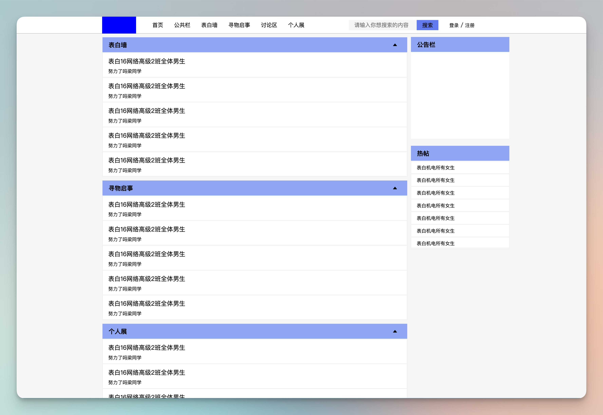

# GETC 学生论坛

[English](./README.md) | 中文

## 预览

[https://layouwen.github.io/getc-student/Home/View/index/index.html](https://layouwen.gitee.io/getc-student/Home/View/index/index.html)

## 介绍

本项目为练习 html+css 而绘制的静态页面. 主题为 GETC 学生论坛, 仅用于参考学习.

## 页面

### Home

- index.html 首页
- login.html 登录页面
- register.html 注册页面
- article.html 文章页面
- search.html 搜索页面
- showArticle.html 文章展示页
- postArticle.html 发帖页
- people_info.html 个人资料页
- people_image.html 头像显示页
- people_password.html 密码修改页
- people_article.html 个人帖子页

### Admin

- admin.html 管理员登录页
- admin_show_user.html 后台用户管理页
- admin_add_user.html 后台用户添加页

## 联系我

[Github](https://github.com/layouwen)